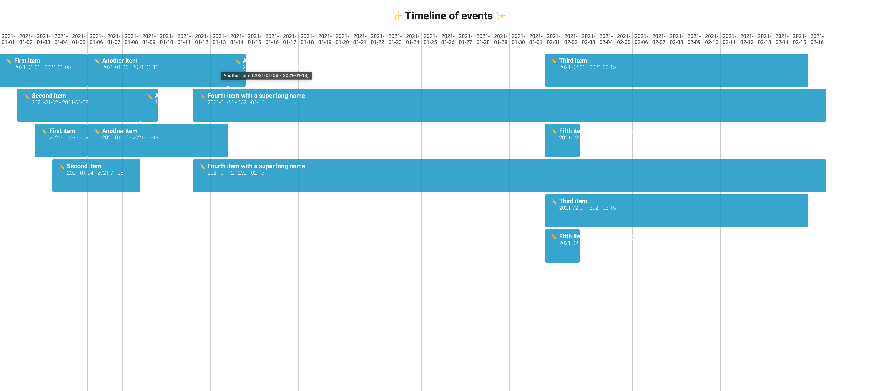

You can access the app deployed here 👉 [CLICK ME](https://event-timeline-app-oyset.ondigitalocean.app/).

**Answers about this test:**

- How long you spent on the assignment.
    
  _It took me about 4 hours._
    
- What you like about your implementation.
    
  _I'm glad to have implemented a good file structure and also a custom hook for the data usage. This makes the code easier for tests, and also enhances the DX (Developer Experience) when dealing with this codebase for the first time._
    
- What you would change if you were going to do it again.
    
  _I think I'd change the colors or tweak a little on the design. Something I'd also give more attention to would be to the dates, as of now they are read-only, but I'd like to work on editing them. On the other hand I know I'd have to deal with many use cases, so I decided to just allow edition of the name of each event for the sake of time._
    
- How you made your design decisions. For example, if you looked at other timelines for inspiration, please note that.
    
  _I was inspired to copy Apple's calendar style. I think it looks cool, so I tried to mimic a bit on the rounded borders, the minimalistic design and on the pastel colors._
    
- How you would test this if you had more time.
    
  _If I were to test this app, I'd probably end up with integration cases, as they are really effective if compared to unit tests. I'd test edition scenarios, as well as different sets of data. The good thing about my implementation is that the code is modular, so I'd be able to mock the hooks, the utility function and so on._
